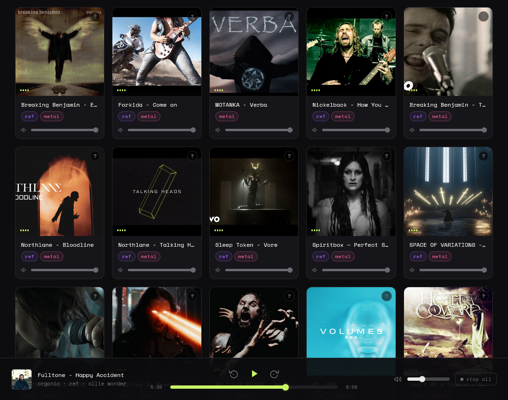

# Music Mood Board

[](https://github.com/o-bardiuk/music-mood-board)

A single-file local HTML audio player for comparing your own mixes and references side by side. No server, no install — open it in a browser and it works.

## What it does

You drop your audio file paths into a JS array at the top of the file, assign each track a genre tag and an album cover image, and the page renders a grid of cards. Click a cover to play. Only one track plays at a time — starting another pauses the current one automatically.

It's designed for the specific workflow of comparing your own mixes against reference tracks: quickly jumping between takes, adjusting relative levels, and keeping everything organized by genre.

## Features

### Playback
- Click any album cover to play or pause that track
- Starting a new track automatically stops the current one
- Audio elements use `preload="none"` so files are only loaded when you actually play them

### Now-Playing Bar (bottom)
Fixed bar at the bottom of the screen showing:
- Thumbnail, filename, and genre tags of the current track
- Seek bar with elapsed / total time — click anywhere to jump, or drag to scrub
- Play/Pause, seek back 5 seconds, seek forward 5 seconds buttons
- Global volume slider affecting all tracks
- Repeat-one and play-next toggles for choosing what happens when a track ends

### Per-Track Volume
Each card has its own volume slider. It multiplies with the global volume, so you can normalize loud references against quieter mixes without touching the master level.

### Genre Filtering
Tags defined per track (e.g. `dnb`, `house`, `metal`, `ref`) appear as filter pills at the top. Click one or more to narrow the grid to only matching tracks. The small badges on each card are clickable too. Each genre gets its own color — both in the filter pills and in the small badges on each card. Click **All** to clear filters.

### File Path Popover
Each card has a `?` button in the top-right corner of the cover. Pressing it opens a small panel showing the full file path. A **copy path** button copies it to the clipboard — useful for quickly finding a file in your DAW or file explorer.

### Keyboard Shortcuts
| Key | Action |
|-----|--------|
| `Space` | Play / Pause current track |
| `←` | Seek back 5 seconds |
| `→` | Seek forward 5 seconds |

Shortcuts are disabled when focus is inside an input field.

### EQ Bars Animation
While a track is playing, animated equalizer bars appear over the album cover so you can see at a glance which card is active.

## Setup

Open `my_music.html` in a browser. Edit the `audioFiles` array near the top of the `<script>` section:

```js
const audioFiles = [
  {
    path: 'file:///D:/Cubase Projects/MyProject/mix.mp3',
    tags: ['house'],
    albumCover: 'https://example.com/cover.jpg',
  },
  // ...
];
```

| Field | Description |
|-------|-------------|
| `path` | Absolute local path (`file:///...`) or relative path (`./folder/file.mp3`) |
| `tags` | Array of genre strings — used for filtering and color coding |
| `albumCover` | Any image URL or local relative path |

The card title is derived automatically from the filename in `path` (extension stripped), so no separate label field is needed.

### Adding new tag colors

Tag colors are defined in CSS. To add a color for a new tag, add two rules:

```css
/* filter pill */
.tag-pill[data-tag="mytag"].selected { --accent: #f5d064; --accent-dim: rgba(245,208,100,0.12); }

/* card badge */
.card-tag[data-tag="mytag"] { color: #f5d064; border-color: rgba(245,208,100,0.35); background: rgba(245,208,100,0.08); }
```

## Browser notes

Works in Chrome, Firefox, and Edge. Local `file:///` paths require the page itself to also be opened from the filesystem (not served from localhost) — otherwise browsers block same-origin local file access. Firefox requires the page and audio files to be in the same directory or a subdirectory when using relative paths.

## File structure

Everything is in one `.html` file — HTML, CSS, and JS. No dependencies, no build step, no network requests except for album cover images and Google Fonts.
